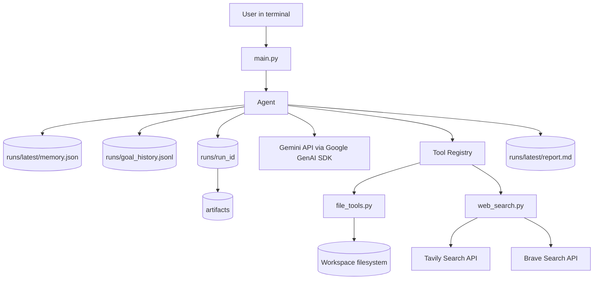
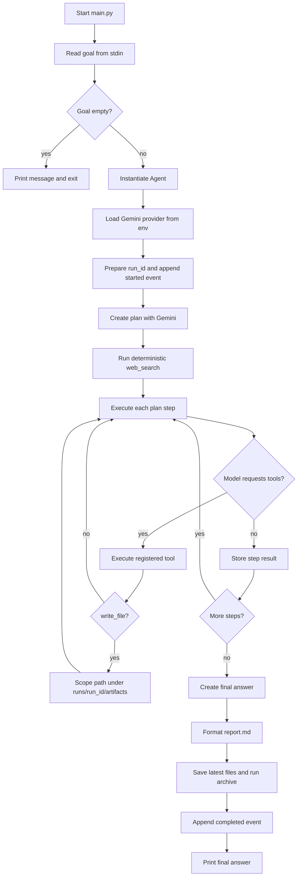
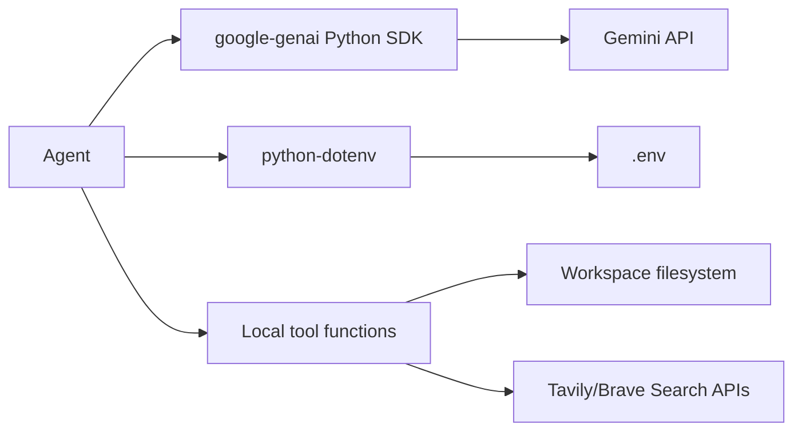

# System Architecture

## High-Level Architecture

The system is a single-process CLI application. `main.py` collects one user goal, creates an `Agent`, and delegates the full workflow to `Agent.run()`. The agent uses Gemini through Google's native GenAI SDK, uses local Python tool functions, persists latest-run memory to `runs/latest/memory.json`, writes the latest report to `runs/latest/report.md`, and archives every run under `runs/<run_id>/` with an append-only `runs/goal_history.jsonl` index. Model-created files are scoped to `runs/<run_id>/artifacts/`.

Evidence:

- CLI entrypoint: [main.py](../gemini_research_agent/main.py#L6-L23)
- Agent runtime workflow: [agent.py](../gemini_research_agent/agent.py#L194-L239)
- Gemini provider creation: [agent.py](../gemini_research_agent/agent.py#L177-L190)
- Tool registry: [agent.py](../gemini_research_agent/agent.py#L170-L175)

## Component Descriptions

| Component | Responsibility | Evidence |
| --- | --- | --- |
| `main.py` | CLI prompt, empty-goal guard, agent construction, final output printing | [main.py](../gemini_research_agent/main.py#L6-L19) |
| `Agent` | Orchestrates provider setup, planning, search, step execution, final answer, memory, report | [agent.py](../gemini_research_agent/agent.py#L138-L239) |
| `ModelProvider` | Holds provider name, model, and Google GenAI SDK client | [agent.py](../gemini_research_agent/agent.py) |
| `_build_model_tools()` | Defines Gemini-visible function declarations for local tools | [agent.py](../gemini_research_agent/agent.py) |
| `tools/file_tools.py` | Workspace-safe local file read/write/list functions | [tools/file_tools.py](../gemini_research_agent/tools/file_tools.py#L11-L48) |
| `tools/web_search.py` | API-backed web search via Tavily primary and Brave fallback | [tools/web_search.py](../gemini_research_agent/tools/web_search.py#L29-L58), [tools/web_search.py](../gemini_research_agent/tools/web_search.py#L93-L204) |
| `runs/latest/memory.json` | Latest-run progress state generated by the agent | [agent.py](../gemini_research_agent/agent.py) |
| `runs/latest/report.md` | Latest-run Markdown report generated from memory and final answer | [agent.py](../gemini_research_agent/agent.py) |
| `runs/goal_history.jsonl` | Append-only start/completion event index for every user goal | [agent.py](../gemini_research_agent/agent.py) |
| `runs/<run_id>/` | Per-run archived `memory.json`, `report.md`, and `artifacts/` files | [agent.py](../gemini_research_agent/agent.py) |

## Core Runtime Flow

## Service Dependencies

## Event and Data Flow

1. `main.py` reads the goal and calls `Agent.run(goal)` ([main.py](../gemini_research_agent/main.py#L6-L14)).
2. `Agent.__init__()` initializes memory and builds a Gemini provider from `GEMINI_API_KEY` and `GEMINI_MODEL` ([agent.py](../gemini_research_agent/agent.py#L141-L192)).
3. `Agent.run()` stores `goal`, `started_at`, prepares `run_id`, appends a `started` history event, then saves latest and archived memory ([agent.py](../gemini_research_agent/agent.py)).
4. `create_plan()` calls Gemini and parses the response into a list of plan steps ([agent.py](../gemini_research_agent/agent.py#L241-L269), [agent.py](../gemini_research_agent/agent.py#L495-L518)).
5. The agent always calls `web_search` once for the goal before executing steps ([agent.py](../gemini_research_agent/agent.py#L209-L215)).
6. Each plan step is executed through `_chat_with_tools()` with the goal, full plan, current step, and search results ([agent.py](../gemini_research_agent/agent.py#L271-L301)).
7. Tool calls from the model are executed through `_execute_tool()` and appended to memory. `write_file` arguments are scoped to the current run's `artifacts/` directory before the file tool writes to disk ([agent.py](../gemini_research_agent/agent.py)).
8. `create_final_answer()` synthesizes the final answer with plan, search results, and step results ([agent.py](../gemini_research_agent/agent.py#L303-L331)).
9. `_save_memory()` writes the latest `runs/latest/memory.json` and archived `runs/<run_id>/memory.json`; `_format_report_from_memory()` builds Markdown from that memory state; `Path.write_text()` saves latest and archived reports; the agent appends a `completed` goal-history event ([agent.py](../gemini_research_agent/agent.py)).

## Key Architectural Decisions

| Decision | Evidence | Impact |
| --- | --- | --- |
| Single-process CLI application | `main()` directly instantiates `Agent` and runs it ([main.py](../gemini_research_agent/main.py#L13-L14)) | Simple local execution; no API server or multi-user runtime |
| Gemini via native Google GenAI SDK | `genai.Client(api_key=gemini_key)` and `client.models.generate_content(...)` ([agent.py](../gemini_research_agent/agent.py)) | Aligns provider usage with Gemini-native function calling and avoids compatibility-layer thought-signature issues |
| Inline prompts | Prompts are hardcoded inside `create_plan`, `execute_step`, and `create_final_answer` ([agent.py](../gemini_research_agent/agent.py#L241-L331)) | Easy to inspect; no prompt versioning or external prompt management |
| Model tools are native declarations | `_build_model_tools()` returns Gemini `FunctionDeclaration` objects and `_chat_with_tools()` executes calls through `_execute_tool()` ([agent.py](../gemini_research_agent/agent.py)) | Native Gemini function calling; adding tools requires code changes |
| Memory is file-based JSON with run archives | `_save_memory()` writes latest memory plus `runs/<run_id>/memory.json`; report generation writes latest plus archived reports; tool-created files are scoped to `runs/<run_id>/artifacts/` ([agent.py](../gemini_research_agent/agent.py)) | Durable local history for every run; no database querying or concurrency locking |
| Search is API-backed with fallback | `web_search` uses configured Tavily/Brave provider order and normalizes JSON results ([tools/web_search.py](../gemini_research_agent/tools/web_search.py#L29-L58), [tools/web_search.py](../gemini_research_agent/tools/web_search.py#L61-L90)) | Requires search API keys; avoids brittle search-result HTML parsing |
| File tools are workspace-constrained and run-scoped for model writes | `_safe_path()` rejects paths outside `WORKSPACE_ROOT`; `_scope_tool_arguments()` routes `write_file` requests into the active run artifacts directory ([tools/file_tools.py](../gemini_research_agent/tools/file_tools.py#L8-L16), [agent.py](../gemini_research_agent/agent.py)) | Reduces path traversal risk and keeps generated artifacts tied to their run |

## Databases and Queues

No database, message queue, event bus, vector store, scheduler, or background worker is present in the current codebase.
