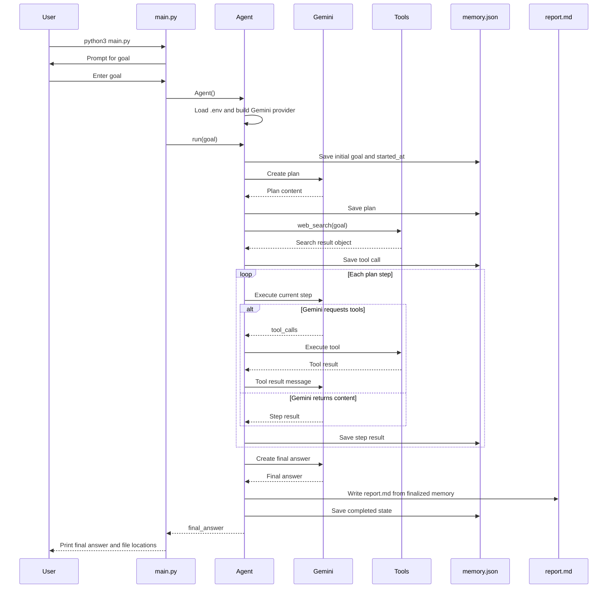
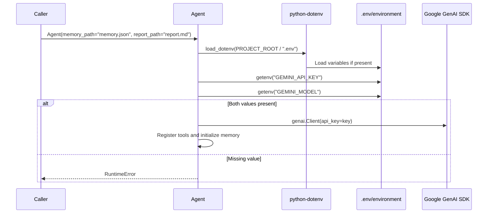
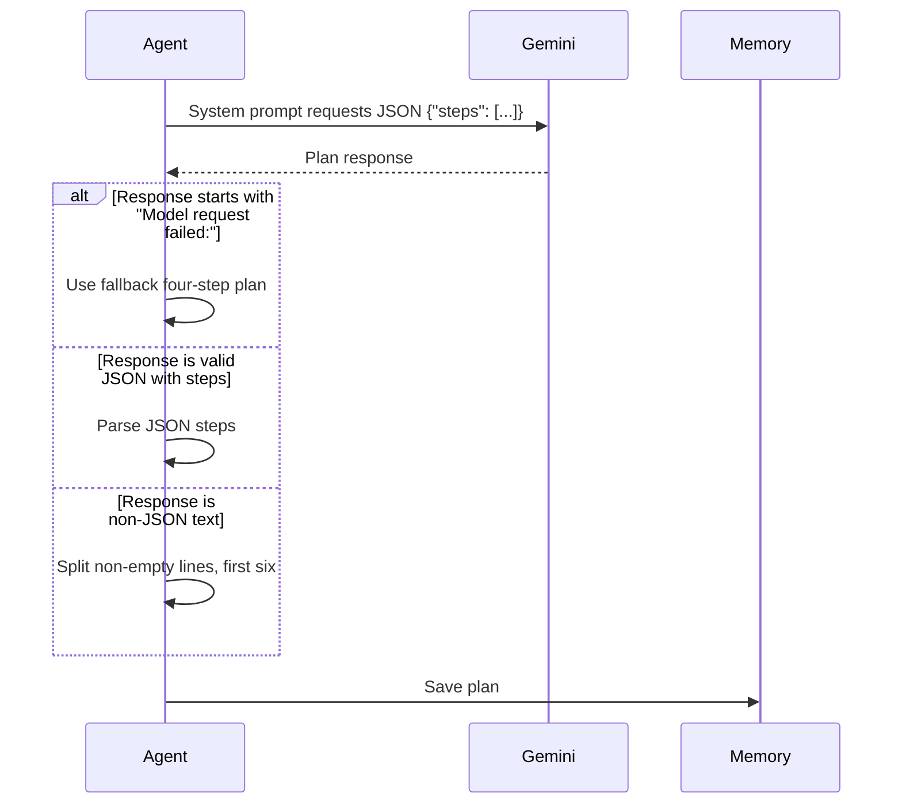
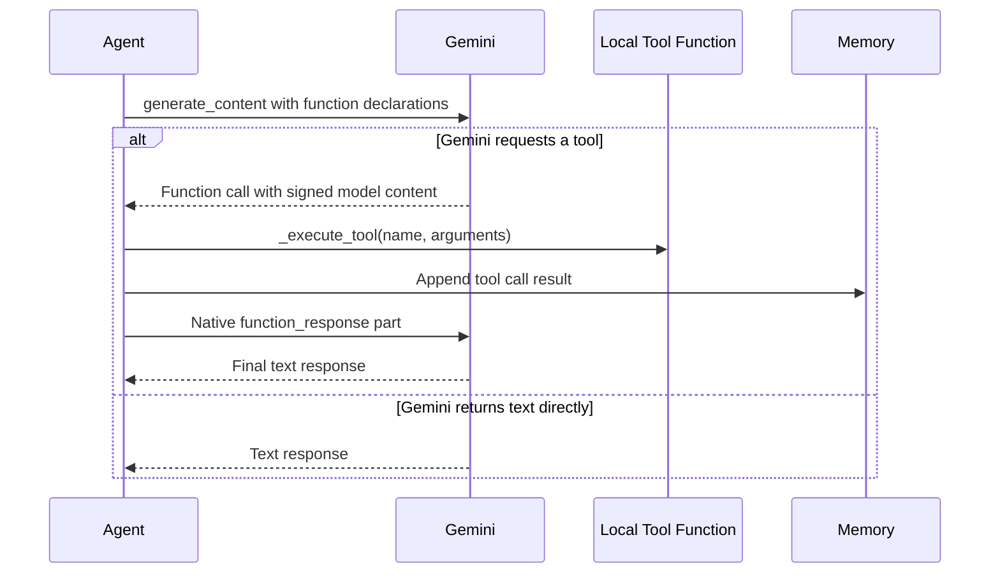
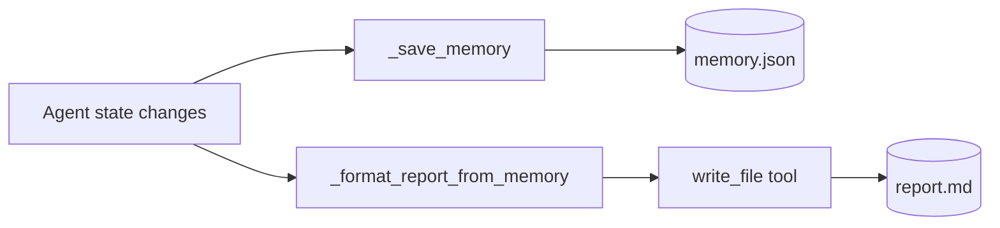
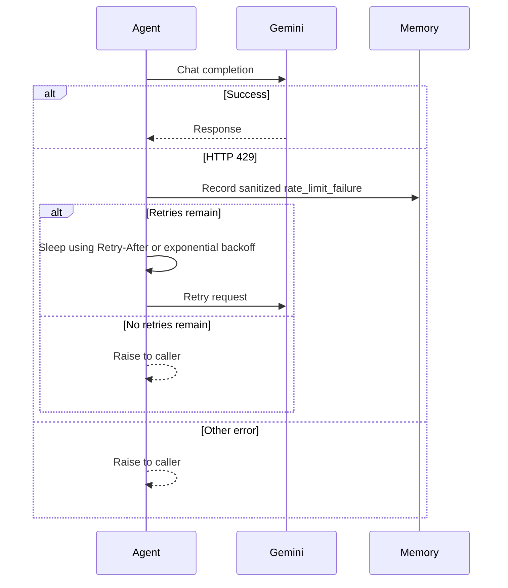

# Workflows

## Workflow 1: User Runs Agent from CLI



Evidence:

- CLI prompt and agent call: [main.py](../main.py#L6-L19)
- Provider construction: [agent.py](../agent.py#L177-L192)
- Main run sequence: [agent.py](../agent.py#L194-L239)
- Tool loop: [agent.py](../agent.py#L347-L424)

## Workflow 2: Agent Construction

There is no separate "create agent" feature or UI. The current creation workflow is Python object construction through `Agent()`.



Evidence:

- `.env` loading: [agent.py](../agent.py#L27-L31)
- Required provider variables and client construction: [agent.py](../agent.py#L177-L190)
- Missing configuration error: [agent.py](../agent.py#L160-L165)
- Tool registry: [agent.py](../agent.py#L170-L175)

## Workflow 3: Plan Creation



Evidence: [agent.py](../agent.py#L241-L269), [agent.py](../agent.py#L495-L518).

## Workflow 4: Tool Calling



Evidence:

- Gemini function declarations and tool execution: [agent.py](../agent.py)
- Tool execution and memory record: [agent.py](../agent.py)

## Workflow 5: Web Search

```mermaid
flowchart TD
    A[web_search(query, max_results)] --> B[Clamp max_results 1..10]
    B --> C[Read SEARCH_PRIMARY and SEARCH_SECONDARY]
    C --> D[Call primary provider API]
    D --> E{Results returned?}
    E -- yes --> F[Return normalized primary results]
    E -- no --> G[Call secondary provider API]
    G --> H{Results returned?}
    H -- yes --> I[Return normalized secondary results]
    H -- no --> J[Return combined provider error object]
```

Evidence: [tools/web_search.py](../tools/web_search.py#L29-L58), [tools/web_search.py](../tools/web_search.py#L61-L90).

## Workflow 6: Memory and Report Persistence



Evidence:

- Memory write: [agent.py](../agent.py#L576-L581)
- Report formatting: [agent.py](../agent.py#L520-L568)
- Final report save via `write_file`: [agent.py](../agent.py#L226-L237)

## Workflow 7: Rate Limit Handling



Evidence: [agent.py](../agent.py#L426-L470), [agent.py](../agent.py#L583-L629).
