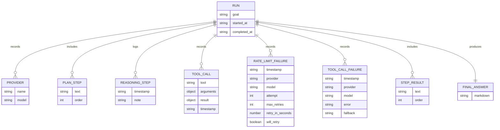

# Data Model

## Summary

The project has no relational database, no migrations, no ORM models, no vector store, and no external state service. Persistent data is stored in local files:

- `runs/latest/memory.json`: structured JSON run state.
- `runs/latest/report.md`: generated Markdown report.
- `runs/goal_history.jsonl`: append-only run start/completion event index.
- `runs/<run_id>/memory.json` and `runs/<run_id>/report.md`: per-run archive files.
- `runs/<run_id>/artifacts/`: per-run files created through the model-visible `write_file` tool.

Evidence:

- Memory path and report path are constructor defaults ([agent.py](../gemini_research_agent/agent.py#L141-L147)).
- Memory is written with `Path.write_text()` ([agent.py](../gemini_research_agent/agent.py#L576-L581)).
- Report is rendered from finalized in-memory state and written directly to `runs/latest/report.md` ([agent.py](../gemini_research_agent/agent.py#L226-L234)).

## `runs/latest/memory.json` Schema

The schema is implicit in `Agent.__init__()` and evolves during execution.

```json
{
  "run_id": "string timestamp identifier",
  "goal": "string",
  "started_at": "string ISO-8601 UTC timestamp",
  "completed_at": "string ISO-8601 UTC timestamp or empty string",
  "history_paths": {
    "memory": "string path",
    "report": "string path",
    "artifacts": "string path",
    "goal_history": "string path"
  },
  "providers": [
    {
      "name": "string",
      "model": "string"
    }
  ],
  "plan": ["string"],
  "reasoning_steps": [
    {
      "timestamp": "string ISO-8601 UTC timestamp",
      "note": "string"
    }
  ],
  "rate_limit_failures": [
    {
      "timestamp": "string ISO-8601 UTC timestamp",
      "provider": "string",
      "model": "string",
      "attempt": "integer",
      "max_retries": "integer",
      "retry_in_seconds": "number",
      "will_retry": "boolean"
    }
  ],
  "tool_call_failures": [
    {
      "timestamp": "string ISO-8601 UTC timestamp",
      "provider": "string",
      "model": "string",
      "error": "string",
      "fallback": "string"
    }
  ],
  "tool_calls": [
    {
      "tool": "string",
      "arguments": "object",
      "effective_arguments": "object, present when arguments were rewritten",
      "result": "object or scalar",
      "timestamp": "string ISO-8601 UTC timestamp"
    }
  ],
  "step_results": ["string"],
  "final_answer": "string"
}
```

Evidence:

- Initial keys: [agent.py](../gemini_research_agent/agent.py#L148-L158)
- Provider records: [agent.py](../gemini_research_agent/agent.py#L167-L169)
- Tool call records: [agent.py](../gemini_research_agent/agent.py#L485-L491)
- Rate-limit records: [agent.py](../gemini_research_agent/agent.py#L603-L612)
- Timestamp generation: [agent.py](../gemini_research_agent/agent.py#L695-L698)

## Relationships



This ER diagram models JSON document structure, not database tables.

## `runs/latest/report.md` Structure

`runs/latest/report.md` is generated from `_format_report_from_memory()` and contains these sections:

1. `# Agent Report`
2. `## Goal`
3. `## Providers`
4. `## Plan`
5. `## Reasoning Steps`
6. `## Rate Limit Failures`
7. `## Tool-Calling Failures`
8. `## Step Results`
9. `## Final Answer`

Evidence: [agent.py](../gemini_research_agent/agent.py#L520-L568).

## Tool Result Schemas

### `read_file`

```json
{
  "path": "string",
  "content": "string"
}
```

Evidence: [tools/file_tools.py](../gemini_research_agent/tools/file_tools.py#L19-L22).

### `write_file`

```json
{
  "path": "string actual scoped path",
  "status": "written"
}
```

Evidence: [tools/file_tools.py](../gemini_research_agent/tools/file_tools.py#L25-L30).

When `write_file` is invoked by the model, the original requested filename is stored in `tool_calls[].arguments.path`. The agent rewrites the actual file path under `runs/<run_id>/artifacts/` and stores that scoped path in `tool_calls[].effective_arguments.path` and `tool_calls[].result.path` ([agent.py](../gemini_research_agent/agent.py)).

### `list_files`

```json
{
  "path": "string",
  "files": ["string"]
}
```

Evidence: [tools/file_tools.py](../gemini_research_agent/tools/file_tools.py#L33-L48).

### `web_search`

Success:

```json
{
  "query": "string",
  "provider": "tavily or brave",
  "results": [
    {
      "title": "string",
      "url": "string",
      "snippet": "string"
    }
  ]
}
```

Failure or no parsed results:

```json
{
  "query": "string",
  "provider": "tavily,brave",
  "results": [],
  "error": "string"
}
```

Evidence: [tools/web_search.py](../gemini_research_agent/tools/web_search.py#L29-L58), [tools/web_search.py](../gemini_research_agent/tools/web_search.py#L93-L204).

## Vector Stores

No vector store, embedding model, semantic index, or retrieval database is present.

## Memory Store

`runs/latest/memory.json` is the latest-run memory file and is overwritten on each `_save_memory()` call. Each run is also archived to `runs/<run_id>/memory.json`, the matching report is archived to `runs/<run_id>/report.md`, and model-created files are written under `runs/<run_id>/artifacts/`.

`runs/goal_history.jsonl` is append-only. The agent writes a `started` event when a goal begins and a `completed` event after the final report is written. This creates a durable index of every user goal even though `runs/latest/memory.json` and `runs/latest/report.md` remain latest-run convenience files.

Evidence: [agent.py](../gemini_research_agent/agent.py#L576-L581).
