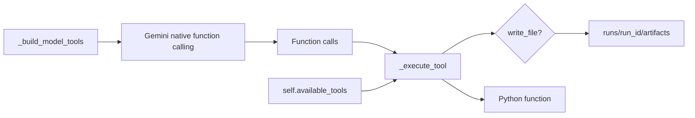
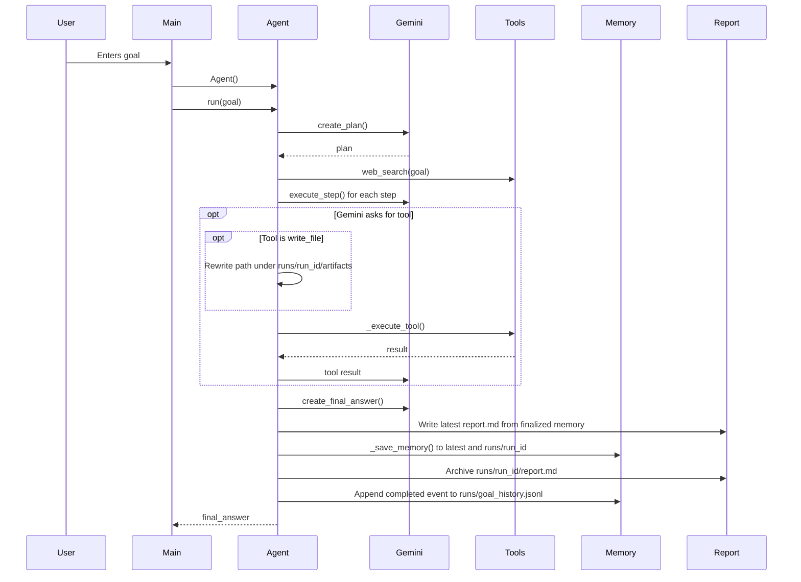

# Agent Creation Flow

## Important Scope Note

The current project is not an agent creation platform in the product/UI sense. There is no web app, no "Create Agent" button, no persistent agent registry, no agent templates database, and no user-managed agent definitions.

The closest current equivalent to "agent creation" is constructing the Python `Agent` class from `main.py`:

```python
agent = Agent()
```

Evidence: [main.py](../gemini_research_agent/main.py#L13-L14), [agent.py](../gemini_research_agent/agent.py#L138-L192).

## 1. How Agents Are Defined

Agents are defined in code as the `Agent` class. The class owns:

- Runtime output paths.
- Memory dictionary shape.
- Per-run artifact paths.
- Gemini provider setup.
- Tool registry.
- Planning, execution, final-answer, persistence, and error-handling methods.

Evidence: [agent.py](../gemini_research_agent/agent.py#L138-L239).

There is no external YAML/JSON agent definition file.

## 2. How Prompts Are Stored

Prompts are inline string literals in `agent.py`.

| Prompt Area | Location | Purpose |
| --- | --- | --- |
| Planning prompt | `create_plan()` | Requests JSON-only plan with 3-6 steps |
| Step execution prompt | `execute_step()` | Instructs model to execute one plan step and use tools when helpful |
| Final answer prompt | `create_final_answer()` | Requests clear Markdown answer with findings and links |

Evidence: [agent.py](../gemini_research_agent/agent.py#L241-L331).

There is no prompt directory, prompt database, prompt versioning, or prompt template engine.

## 3. How Tools Are Registered

Tool registration has two parts:

1. Gemini-facing function declarations created by `_build_model_tools()`.
2. Runtime function mapping in `self.available_tools`.

Evidence:

- Gemini function declarations and runtime mapping: [agent.py](../gemini_research_agent/agent.py)



## 4. How Workflows Are Created

Workflows are not user-created or stored. The workflow is hardcoded in `Agent.run()`:

1. Save initial memory.
2. Create a plan.
3. Search the web.
4. Execute each plan step and route any model-created files to that run's `artifacts/` directory.
5. Create final answer.
6. Format and write report.
7. Save final memory.

Evidence: [agent.py](../gemini_research_agent/agent.py#L194-L239).

## 5. How Execution Occurs

Execution starts from the CLI:



Evidence:

- CLI execution: [main.py](../gemini_research_agent/main.py#L6-L23)
- Agent execution: [agent.py](../gemini_research_agent/agent.py#L194-L239)
- Tool calling: [agent.py](../gemini_research_agent/agent.py#L347-L424)

## 6. How Memory Works

Memory is a Python dictionary initialized in `Agent.__init__()` and persisted as latest `runs/latest/memory.json` plus archived `runs/<run_id>/memory.json`.

Memory is updated at these points:

- Start of run: goal and started timestamp.
- Run history preparation: `run_id`, archive paths, and a `started` JSONL event.
- Tool artifact preparation: `history_paths.artifacts` points to `runs/<run_id>/artifacts`.
- After plan creation.
- After web search.
- After each step result.
- During tool calls.
- During rate-limit failures.
- After final answer and completion timestamp.
- Finalization: latest report, archived report, completed archived memory, and a `completed` JSONL event.

Evidence:

- Initial memory shape: [agent.py](../gemini_research_agent/agent.py#L148-L158)
- Save calls in run flow: [agent.py](../gemini_research_agent/agent.py#L194-L239)
- Tool call append: [agent.py](../gemini_research_agent/agent.py#L485-L491)
- Rate-limit append: [agent.py](../gemini_research_agent/agent.py#L603-L612)
- JSON persistence: [agent.py](../gemini_research_agent/agent.py#L576-L581)

## 7. How Results Are Generated

Step results are generated by Gemini for each plan step. Final answer generation uses:

- original goal,
- plan,
- web search results,
- step results.

Evidence: [agent.py](../gemini_research_agent/agent.py#L303-L331).

The Markdown report is generated locally by `_format_report_from_memory()`, not directly by Gemini. It includes the final Gemini answer plus local metadata sections.

Evidence: [agent.py](../gemini_research_agent/agent.py#L520-L568).

Files generated through model `write_file` calls are generated by the file tool, but the agent first scopes the requested relative path into `runs/<run_id>/artifacts/`. The memory record keeps the requested path in `arguments` and the actual written path in `effective_arguments` and `result`.

## What Happens from "Create Agent" to Result?

Because there is no UI "Create Agent" action, this describes the actual code path from `Agent()` to result:

```mermaid
flowchart TD
    A[Agent() called] --> B[Initialize memory paths]
    B --> C[Create memory dictionary]
    C --> D[Read GEMINI_API_KEY and GEMINI_MODEL]
    D --> E{Both present?}
    E -- no --> F[Raise RuntimeError]
    E -- yes --> G[Create Google GenAI SDK client for Gemini]
    G --> H[Register tools]
    H --> I[run(goal)]
    I --> J[Plan with Gemini]
    J --> K[Search web]
    K --> L[Execute plan steps]
    L --> M[Use tools if model requests them]
    M --> A1{write_file requested?}
    A1 -- yes --> A2[Write under runs/run_id/artifacts]
    A1 -- no --> N[Create final answer]
    A2 --> N
    N --> O[Write latest report.md]
    O --> P[Write latest memory.json]
    P --> R[Write runs/run_id archive]
    R --> S[Append completed event]
    S --> Q[Return result to CLI]
```

Evidence: [agent.py](../gemini_research_agent/agent.py#L141-L239).

## Unknowns and Absent Platform Features

The following cannot be documented as present because no code evidence exists:

- Agent marketplace or registry.
- User-click-driven creation flow.
- Database-backed agent persistence beyond generated local run history.
- Prompt management UI.
- Workflow builder.
- Multi-user state.
- Authorization beyond API key configuration.
